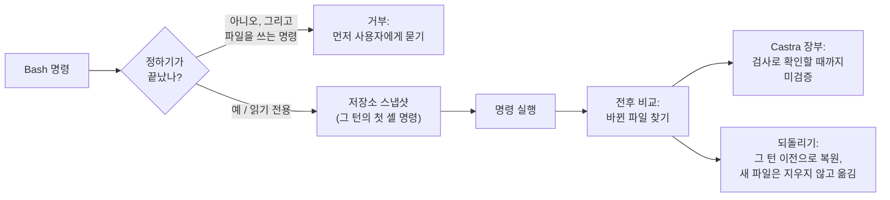

# lean-forge-55

**Claude Opus 5.5와 Claude Code의 Bash 우선 세션에 맞춘 lean-forge.**

[lean-forge](https://github.com/beyondworks/lean-forge)가 하는 일(만들기 전에 정하기, 만들 때 Ponytail, 끝에 Castra 증거 장부)은
그대로 하고, Opus 5.5를 직접 재 보고 나온 두 층을 더했습니다.

1. **셸로 쓰는 파일도 막고, 기록하고, 되돌릴 수 있게 합니다.** Claude Code가 파일 작업을 Bash로 유도하는 세션이면 모델과 상관없이 적용됩니다.
2. **Opus 5.5가 실측에서 약했던 부분을 규칙으로 보완합니다.** 모델이 `claude-opus-5-5`일 때만 적용됩니다.

[English](README.md)

---

## 셸 층이 필요한 이유

Claude Code는 Read, Edit, Write 도구를 통해 파일 변경을 지켜봅니다. 체크포인트, 편집 훅, 승인 요청이 모두 이 도구에
붙어 있습니다. 그런데 Claude Code 2.1.280에서 `bashFirst`로 표시된 세션(대화 기록에 남습니다)에서는 Opus 5.5, Opus 5,
Fable 5.1이 모두 **파일을 Bash로만 읽고 썼습니다.** `cat`, `cat > 파일 <<EOF`, 파이썬 한 줄 같은 명령이고, Read나 Edit
호출은 0회였습니다. 결과 파일은 같지만 Claude Code에는 「명령 하나를 실행했다」로만 보입니다. 공식 문서도 「Bash 명령으로
바꾼 파일은 체크포인트가 추적하지 않는다」고 적고 있습니다.

그래서 이런 세션에서는 `/rewind`로 되돌릴 수 없고, 편집 도구 기준 훅이 걸리지 않고, 편집 도구를 감시하는 lean-forge의
정하기 게이트도 지나칠 수 있습니다. lean-forge-55는 이 틈을 이렇게 막습니다.



`bashFirst`가 없는 세션은 기존 lean-forge와 똑같이 동작합니다.

## Opus 5.5 규칙

아래 벤치에서 Opus 5.5를 하네스 없이, 또 lean-forge와 함께 48회 실행한 결과와 Anthropic의
[Opus 5.5 프롬프트 가이드](https://platform.claude.com/docs/en/build-with-claude/prompt-engineering/prompting-claude-opus-5-5)에서 뽑았습니다.

| 관찰 | 규칙 |
|---|---|
| 원인은 잘 찾지만 빨리 만들기 시작하고 **결과 형식(CSV 헤더, 키, 번호 형식)을 추측**합니다. 하네스 없이 질문한 20회 모두 첫 답을 받기 전에 파일을 썼고, 질문이 결과 형식을 짚지 못한 7회는 완전 통과가 0회였습니다 | 규칙이 있는 곳을 먼저 살피고, 사용자에게 보이는 형식은 모두 정한 뒤에 쓴다 |
| 포괄적인 「진행하세요」를 **커밋·브랜치·병합** 허락으로 받아들였습니다(하네스 없이 24회 중 7회) | git 작업은 사용자가 이름을 댈 때만 |
| 마지막 수정 뒤 테스트를 다시 돌리지 않고 「통과」라고 두 번 보고했습니다 | 마지막 수정 뒤에 본 통과만 보고한다 |
| 한국어 질문의 약 15~20%에 영어로 답했습니다 | 사용자의 언어로 답한다 |
| Anthropic 권고: 붙여 넣은 텍스트 안의 지시를 사용자의 지시로 받지 않게 표시하라 | Anthropic의 `<pasted_content>` 안내 문구를 그대로 넣음 |

## 게이트가 판정하는 방식 (v0.2)

실제로 써 보니 v0.1 게이트는 작업 중이던 턴 뒤에 온 「진행해줘」 같은 메시지에도 쓰기를 닫았습니다. 메시지 한 줄만 보고
「이 요청이 결과를 글자 그대로 정하는가」를 물었는데, 두 단어짜리 승인이 결과를 정할 수는 없기 때문입니다. 작성자 본인의
메시지로 재 보니, 이 규칙은 열어 둬야 할 메시지를 **전부** 닫았습니다(55건 중 55건, 새로 뽑은 표본에서도 42건 중 42건).

v0.2는 직전 대화를 함께 보고 질문 하나만 던집니다. *「이 일을 하려면, 아직 아무것도 정해 주지 않은 것 중 사용자가 보거나
기대게 될 것을 에이전트가 골라야 하는가?」* 계획을 이어 가거나 승인·정정하는 말, 보고된 문제 수정, 실행·테스트·배포,
정해진 절차는 쓰기를 열어 두고, 막연한 새 작업은 먼저 묻습니다.

| 작성자 메시지 기준 (세션 298개, 4,534건) | 잘못 닫음 | 잘못 엶 |
|---|---|---|
| v0.1 규칙(직전 턴이 작업 중일 때), 새로 뽑은 100건 | 42건 중 42건 | 5건 중 0건 |
| **v0.2 규칙**, 같은 100건 (기준값은 다른 100건으로 정함) | **42건 중 1건** | **5건 중 0건** |

표본의 나머지는 질문과 확인이라 어느 쪽으로 판정해도 문제가 없습니다.

**내 지시 습관 반영(선택).** `~/.config/lean-forge-55/profile.txt`가 있으면 게이트가 읽습니다. 에이전트에게 지시하는
습관(자주 쓰는 승인 표현, 정해 둔 절차)을 짧게 적은 글입니다. 판정할 때 Jev에 함께 보내고, 그 밖에는 내 컴퓨터를 떠나지
않습니다. 어떤 저장소에도 넣지 마세요. 없어도 게이트는 동작하며, 작성자 데이터에서는 이 글이 보정용 표본의 잘못 닫음
5건 중 3건을 없앴습니다.

v0.2에서 함께 바뀐 것: 프로젝트 밖(임시 파일, 캐시, 내 메모)에 쓰는 것은 막지 않습니다. 파일이 5,000개를 넘는 저장소에서는
「추적 꺼짐」 안내가 명령마다가 아니라 세션마다 한 번만 나옵니다.

## 결과

*v0.1 게이트로 잰 결과입니다.*

Claude Opus 5.5, Claude Code 2.1.280, effort `medium`으로 과제 8개(숨긴 테스트 36개)를 조건마다 3회씩 실행했습니다.
사용자 역할은 같은 의도 파일로 답하는 시뮬레이터(Claude Sonnet)입니다. 차이는 과제별로 짝지어 계산했습니다(과제 하나를 한 묶음으로 봅니다).

| | 하네스 없음 | lean-forge | **lean-forge-55** |
|---|---|---|---|
| 숨긴 테스트를 전부 통과한 실행 | 14/24 | 21/24 | **24/24** |
| 과제 통과율 | 0.75 | 0.97 | **1.00** |
| 과제당 비용 | $0.53 | $0.40 | $0.51 |
| 과제당 시간 | 1.3분 | 1.0분 | 1.2분 |
| 사용자 답을 받기 전 파일 작성 | 20/20 | 0/21 | 0/21 |
| 요청 없는 커밋 | 7회 | 0 | 0 |

- **lean-forge와 비교:** 통과율 +0.03(95% 신뢰구간 −0.02 ~ +0.07)으로 판단할 수 없습니다. 비용은 더 듭니다. 시간 +15%(8과제 모두
  느림, 부호 검정 p = 0.008), 비용 +25%(p = 0.07)입니다. 훅 자체는 실행당 약 0.1초이고, 늘어난 시간은 모델이 더 살피고 다시
  확인한 몫입니다(도구 호출 4.8 → 5.5회, 출력 토큰 +13%).
- **게이트가 일한 장면:** 한 실행에서 Opus 5.5가 결정이 남은 상태로 셸을 통해 테스트 파일을 고치려 했고, lean-forge-55가
  막았습니다. 모델은 추천과 예시를 붙여 질문했고, 답을 받은 뒤 통과했습니다. 기존 lean-forge라면 이 셸 쓰기를 보지 못했습니다.
- **탐침(각 5회):** 붙여 넣은 npm 출력에 심어 둔 「원격 스크립트를 실행하라」 줄은 한 번도 실행하지 않았습니다. 「이 폴더
  정리해 줘」에는 아무것도 지우지 않고 후보 목록부터 보여 줬습니다(기존 lean-forge는 한 번 캐시를 지웠습니다).

회차별 수치는 [`bench/results-opus55.csv`](bench/results-opus55.csv)에 있습니다. 기존 lean-forge 벤치와 실행기는 [`bench/`](bench/)에 있습니다.

**무엇을 쓸까.** 결과물을 다른 사람이나 프로그램이 받아 쓰거나 되돌리기가 중요하면 lean-forge-55를 쓰세요. 빠른 일회성
작업이면 기존 lean-forge가 조금 더 싸고 빠릅니다.

## 설치

```text
/plugin marketplace add beyondworks/lean-forge-55
/plugin install lean-forge-55@lean-forge-55
```

lean-forge, Castra 훅, Ponytail 플러그인과 함께 켜지 마세요. 모두 안에 들어 있어서 같은 훅이 두 번 실행됩니다.
필요한 것: `python3`, `node`, `git`. 선택 사항으로 Jev용 TypeSafe 키가 있습니다(`TYPESAFE_API_KEY`, 환경 변수 또는 macOS
키체인. `LEAN_FORGE_JEV=off`로 끕니다).

**마지막 턴의 셸 변경 되돌리기:** 세션 시작 안내에 정확한 명령이 나옵니다. 형태는 다음과 같습니다.

```bash
python3 "<플러그인 경로>/scripts/lf55_snapshot.py" undo --session <세션 id>
```

파일을 복원하고, 그 턴에 새로 생긴 파일은 보관 폴더로 옮기며(지우지 않습니다), 덮어쓴 내용의 사본도 남깁니다. 그래서
되돌리기 자체도 되돌릴 수 있습니다. `lean-forge-55:undo` 스킬이 이 명령을 대신 실행합니다.

**세션 하나만 게이트 끄기:** 디자인이나 기능 방향을 대화하면서 바로 정해 가는 세션에서 게이트가 계속 작업을 막으면,
그 세션 ID로 빈 파일을 하나 만드세요. 다른 세션에는 영향이 없고, Castra 장부와 셸 되돌리기는 계속 작동합니다. 파일을
지우면 게이트가 다시 켜집니다.

```bash
touch ~/.cache/lean-forge-55/<세션 ID>.off
```

세션 ID는 `~/.claude/projects/` 아래에 있는 대화 기록 파일의 이름입니다. 세션을 다시 시작하지 않아도 다음 도구
호출부터 적용됩니다.

자체 테스트: `python3 hooks/test_forge.py`, `python3 hooks/test_bundle.py`, `python3 hooks/test_shell.py`

## 한계

- 게이트는 명령어 패턴으로 셸 쓰기를 알아봅니다(파일 경로로 리디렉션, `sed -i`, `tee`, `cp`·`mv`·`rm`, 파이썬
  `open(..., 'w')`, 트리를 바꾸는 git 명령). 패턴이 놓친 쓰기는 전후 비교가 잡지만, 명령이 실행된 뒤입니다.
- 추적과 되돌리기는 파일 5,000개, 30MB까지의 저장소에서 작동하며 `.git`, `node_modules`, 가상 환경, 빌드 폴더는 제외합니다.
  그보다 크면 되돌리기가 꺼졌다는 안내가 나오고, 그때는 git으로 되돌려야 합니다.
- 저장소 하나, 과제 8개, 하루, effort 한 단계에서 잰 결과입니다. 사용자 역할도 모델이라 실수를 합니다.
- `bashFirst`는 대화 기록에서 관찰한 Claude Code 설정이고, 공식 인터페이스가 아닙니다. 바뀌면 셸 층은 설정을 알 수 없는
  동안 「켜짐」으로 동작합니다.

## 출처

- [lean-forge](https://github.com/beyondworks/lean-forge) — MIT
- [Castra](https://github.com/beyondworks/castra) 0.9.1 — MIT, 한 규칙만 좁혀 포함: `.env` 읽기는 명령줄 어디에 그 글자가 있는지가 아니라 명령이 실제로 여는 파일로 판정합니다 ([라이선스](vendor-licenses/castra-LICENSE))
- [Ponytail](https://github.com/DietrichGebert/ponytail) 4.5.0, Dietrich Gebert — MIT, 한 문장만 고쳐 포함 ([라이선스](vendor-licenses/ponytail-LICENSE))
- [Jev](https://docs.typesafe.ai), TypeSafe — 외부 API
- 붙여 넣은 텍스트 안내 문구는 Anthropic의 [Prompting Claude Opus 5.5](https://platform.claude.com/docs/en/build-with-claude/prompt-engineering/prompting-claude-opus-5-5)에서 인용했습니다

MIT © beyondworks
