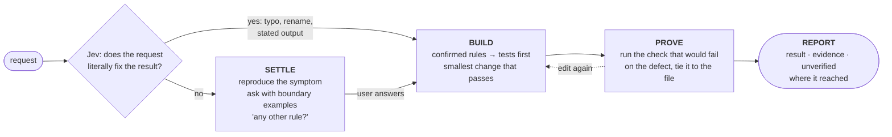
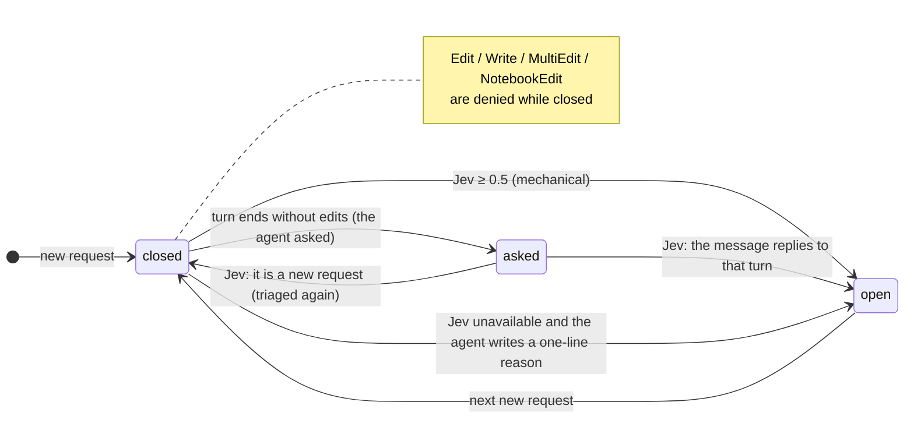
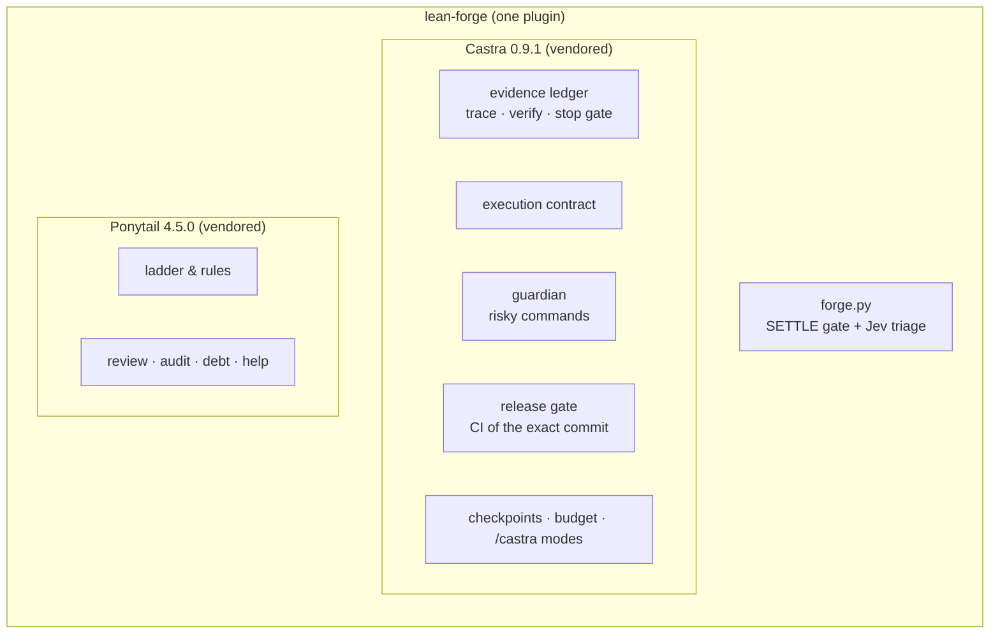

# lean-forge

**Ask what matters. Build the least. Prove it ran.**

One Claude Code plugin that settles the decisions a result depends on before any file is touched,
builds the smallest thing that satisfies them, and closes every edit with evidence.
It carries its own copies of [Castra](https://github.com/beyondworks/castra) and
[Ponytail](https://github.com/DietrichGebert/ponytail), and adds a questioning phase that a hook enforces —
so there is nothing else to install and nothing to choose between.

[](https://github.com/beyondworks/lean-forge/releases)


[한국어](README.ko.md)

---

## The idea

Coding agents fail in two opposite ways.

- **Fast harnesses guess.** Told to keep moving, the agent fills every open question with a plausible
  default: English CSV headers the accountant never asked for, an invoice number format nobody approved,
  the user's own wrong diagnosis ("it's probably `round()`") taken as the cause.
- **Thorough harnesses pay for ceremony.** They ask the right questions — and then spend most of their
  time on contract documents, review subagents and branch-and-commit workflows.

The accuracy comes from the questions, asked in the first minutes, not from the ceremony that follows.
The fast harness is fast because it never asks.

lean-forge keeps the questions and drops the ceremony — and it does not trust a prompt to keep the
questions alive. A hook closes file edits until the outcome-changing decisions are settled.
Rules written only as text were followed in 4 of 10 cases; enforced by a hook, in every case.

---

## One flow for every request



| Phase | What happens | Enforced by |
|---|---|---|
| **SETTLE** | A cause the user suggests is a hypothesis: reproduce it. List the decisions the result must answer (structure, behavior, contract, technical). Ask once, at most five items, each with a recommendation and a worked example at a boundary value, and end with *"any other rule you hold?"* | Edits stay closed until the user answers. An independent classifier (Jev) opens them at once for requests that fix their own result. |
| **BUILD** | Each confirmed rule becomes an acceptance test with its reason in one line. Then the Ponytail ladder: does it need to exist → stdlib → native → installed dependency → one line → minimum code. | Ponytail rules, injected every session |
| **PROVE** | Every edited file is tracked as unverified until a check is explicitly tied to it; editing again voids the evidence. | Castra ledger: ending a turn with unverified edits is blocked |
| **REPORT** | What changed, the decisive evidence, what was not verified, and where the change reached: source, installed build, running service, production. | Castra execution contract |

Questions happen only in SETTLE. From BUILD on, the agent never stalls — the two speed rules that used
to fight each other ("don't stall" and "ask first") now live in different phases.

---

## How SETTLE is enforced



The classifier is [Jev](https://docs.typesafe.ai), a small model that returns a probability instead of
text. One call costs about 0.7 s. It separated 16 labeled requests perfectly in Korean and in English
(mechanical ≥ 0.55, needs-a-decision ≤ 0.21). Without a key, or if Jev does not answer, the gate falls
back to asking the agent for a written reason before a mechanical edit.

---

## What is inside



| Part | Kept from the original | Changed |
|---|---|---|
| Castra | Everything: per-file evidence ledger, execution contract, guardian (force push, `DROP`, reading `.env` are handed to the user; `rm -rf`, `reset --hard`, `sudo`, publishing ask first), release gate, checkpoints, budget advisory, `/castra` modes | nothing |
| Ponytail | Everything: ladder, rules, `/ponytail lite\|full\|ultra`, four skills | one sentence: *"ship the lazy version and question it … never stall"* now applies **after** SETTLE |

---

## Results

Eight tasks on a small Python invoicing library, 36 hidden tests. A scripted user (Claude Sonnet)
answered every harness from the same intent file. Model: Claude Opus 5 for every agent. Cost is the
API-price equivalent of the tokens used.

**No other harness loaded**

| Harness | Hidden tests passed | Time | Cost |
|---|---|---|---|
| Castra + Ponytail | 15/36 | 10 min | $3.79 |
| **lean-forge** (2 runs) | **31/36 · 36/36** | **18 min** | **$5.2** |

**Is the difference real?** Fisher's exact test on test counts, paired sign test on time and cost per task.

| lean-forge vs | Accuracy | Time and cost |
|---|---|---|
| Castra + Ponytail | **2.2× higher** (93% vs 42%, p < 0.001) | no significant difference (p = 0.07) |

The same comparison on the author's full personal setup (other plugins, hooks and memory loaded)
gave the same picture: 95% vs 52% (p < 0.001) at equal time (18 vs 19 minutes, p = 1.00).

- 6 of lean-forge's 8 missed tests came from two runs where the scripted user answered against its own
  intent file (it approved a wrong number format, and waved off a question the file answered). The agent
  had asked the right question both times. The other 2 were one rounding boundary every harness missed
  at least once.
- Every file lean-forge edited ended *verified* in the Castra ledger, and the stop gate never had to
  fire (0 of 30 runs; the Castra + Ponytail pair needed it in 7 of 8).

Everything needed to rerun it is in [`bench/`](bench/): tasks, intent files, hidden tests, fixtures,
the runner, and per-run numbers ([`bench/results-summary.csv`](bench/results-summary.csv)).

```bash
cd bench
python3 run.py G t1 1          # lean-forge on task t1, run 1
python3 significance.py        # compare with the recorded results
```

---

## Install

```text
/plugin marketplace add beyondworks/lean-forge
/plugin install lean-forge@lean-forge
```

Requirements: `python3`, `node`, `git`. Optional: a TypeSafe key for Jev, as the environment variable
`TYPESAFE_API_KEY` or a macOS keychain item of that name.

If you already run Castra hooks from `settings.json` or the Ponytail plugin, turn them off — lean-forge
contains both, and the same hooks would run twice.

## Use

There is nothing to call. Make requests as usual:

- A request whose result is fully stated goes straight through.
- Anything else gets one message of questions first. Answer it and the work continues without stopping.
- `/castra review · verify · reframe · finish · resume · status` and `/ponytail lite | full | ultra`
  work as they do in the originals.

Self-tests:

```bash
python3 hooks/test_forge.py    # SETTLE gate, with and without Jev
python3 hooks/test_bundle.py   # guardian, release gate, session contract, evidence ledger, Ponytail
```

---

## Limits

- One small repository and eight tasks; the older harnesses ran once per task. Large codebases,
  multi-module changes and verification on real screens or installed apps were not part of the
  benchmark; the guardian, release gate and ledger are covered by `hooks/test_bundle.py` instead.
- The scripted user is itself a model and made mistakes (above).
- The SETTLE gate watches the edit tools. A file written through the shell passes it, as it passes
  Castra's ledger.
- The Jev threshold (0.5) was set on 16 requests. Tune it on real traffic.

## Credits

- [Castra](https://github.com/beyondworks/castra) 0.9.1 — MIT, vendored unchanged ([license](vendor-licenses/castra-LICENSE))
- [Ponytail](https://github.com/DietrichGebert/ponytail) 4.5.0 by Dietrich Gebert — MIT, vendored with one sentence changed ([license](vendor-licenses/ponytail-LICENSE))
- [Jev](https://docs.typesafe.ai) by TypeSafe — external API

MIT © beyondworks
