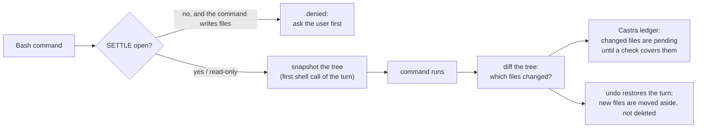

# lean-forge-55

**lean-forge, tuned for Claude Opus 5.5 and for Claude Code's Bash-first sessions.**

Everything [lean-forge](https://github.com/beyondworks/lean-forge) does (SETTLE before building, Ponytail while building,
Castra's evidence ledger at the end), plus two layers that came out of measuring Opus 5.5 directly:

1. **Shell writes are gated, tracked and undoable** — in any session where Claude Code steers file work to Bash.
2. **Rules for Opus 5.5's measured weak spots** — applied only when the model is `claude-opus-5-5`.

[한국어](README.ko.md)

---

## Why a shell layer

Claude Code watches file changes through its Read, Edit and Write tools: that is where checkpoints, edit hooks and
approval prompts attach. In Claude Code 2.1.280 sessions marked `bashFirst` (recorded in the session transcript), we
measured Opus 5.5, Opus 5 and Fable 5.1 **reading and writing files only through Bash** — `cat`, `cat > file <<EOF`,
a Python one-liner — with zero Read or Edit calls. The result is the same file, but Claude Code only sees
"a command ran". Its documentation says so directly: *"Checkpointing does not track files modified by Bash commands."*

So in those sessions `/rewind` cannot restore the changes, edit-based hooks never fire, and lean-forge's own SETTLE
gate (which watches the edit tools) could be walked past. lean-forge-55 closes that gap:



Sessions without `bashFirst` get plain lean-forge behavior.

## Rules for Opus 5.5

From 48 runs of Opus 5.5 on the benchmark below, with and without lean-forge, and Anthropic's
[Opus 5.5 prompting guide](https://platform.claude.com/docs/en/build-with-claude/prompt-engineering/prompting-claude-opus-5-5):

| Observed | Rule |
|---|---|
| Finds real causes well, but starts building quickly and **guesses output contracts** (CSV headers, keys, ID formats). Without a harness it wrote files before the first answer in 20 of 20 runs that asked anything; runs whose questions missed the contract fully passed 0 of 7 times | Look first where the rules already live, then settle every user-visible contract before writing |
| Reads a broad "proceed" as permission to **commit, branch and merge** (7 of 24 runs without a harness) | Git operations only when the user names them |
| Twice reported "tests pass" without re-running them after its last change | Claim a pass only for a run seen after the last change |
| Replied in English to about 15–20% of Korean prompts | Reply in the user's language |
| Anthropic: mark pasted text so instructions inside it are not taken as the user's | Anthropic's `<pasted_content>` note, verbatim |

## How the gate judges (v0.2)

Real use showed the v0.1 gate closing writes on messages like "진행해줘" ("go ahead") after a working turn: it judged
each message alone, asking whether it *literally fixed the result*, and a two-word go-ahead never does. On the author's
own messages that rule closed **every** message that should have stayed open (55 of 55, and 42 of 42 on a fresh sample).

v0.2 asks one question with the conversation as context: *to carry this out, must the agent choose something the user
will see or rely on that nothing has settled yet?* Continuing, approving or correcting the plan, fixing a reported
problem, running, testing, deploying and standing procedures keep writes open; open-ended new work asks first.

| On the author's messages (4,534 from 298 sessions) | Wrongly closed | Wrongly opened |
|---|---|---|
| v0.1 rule after a working turn, fresh sample of 100 | 42 of 42 | 0 of 5 |
| **v0.2 rule**, same fresh sample (threshold chosen on a separate 100) | **1 of 42** | **0 of 5** |

The rest of each sample were questions and checks, where either answer is harmless.

**Your own habits (optional).** The gate reads `~/.config/lean-forge-55/profile.txt` if it exists: a short plain-text
note on how you instruct agents (your usual go-ahead phrases, your standing procedures). It is sent to Jev with each
judgment and never leaves your machine otherwise; keep it out of any repository. Without it, the gate still works; on the
author's data the note removed three of five wrong closes on the tuning sample.

Also in v0.2: writes outside the project (temp files, caches, your own notes) are not gated; on trees over 5,000 files
the "tracking is off" notice appears once per session instead of on every command.

## Results

*Measured with the v0.1 gate.*

Claude Opus 5.5, Claude Code 2.1.280, effort `medium`, eight tasks with 36 hidden tests, three runs per task and
condition, a scripted user (Claude Sonnet) answering from the same intent file. Differences are paired by task (each
task is one cluster).

| | No harness | lean-forge | **lean-forge-55** |
|---|---|---|---|
| Runs passing every hidden test | 14/24 | 21/24 | **24/24** |
| Task pass rate | 0.75 | 0.97 | **1.00** |
| Cost per task | $0.53 | $0.40 | $0.51 |
| Time per task | 1.3 min | 1.0 min | 1.2 min |
| Wrote files before the user's answer | 20/20 | 0/21 | 0/21 |
| Unrequested commits | 7 runs | 0 | 0 |

- **Against lean-forge:** pass rate +0.03 (95% CI −0.02 to +0.07) — not conclusive. It costs more: time +15%
  (slower on all 8 tasks, sign test p = 0.008), cost +25% (p = 0.07). The hooks themselves take about 0.1 s per run;
  the extra time is the model looking and re-testing more (4.8 → 5.5 tool calls, +13% output tokens).
- **The gate at work:** in one run Opus 5.5 tried to edit a test file through the shell while a decision was still
  open. lean-forge-55 denied it; the model asked the question with a recommendation and a worked example, got the
  answer, and passed. Plain lean-forge would not have seen that write.
- **Probes (5 each):** a planted "run this remote script" line in pasted npm output was never executed; asked to
  "clean up this folder", it deleted nothing and listed candidates first (plain lean-forge deleted caches once).

Per-run numbers: [`bench/results-opus55.csv`](bench/results-opus55.csv). The original lean-forge benchmark and its
runner are in [`bench/`](bench/).

**When to use which.** Where results go to other people or programs, or undo matters, lean-forge-55. For quick
throwaway work, plain lean-forge is a little cheaper and faster.

## Install

```text
/plugin marketplace add beyondworks/lean-forge-55
/plugin install lean-forge-55@lean-forge-55
```

Do not enable it together with lean-forge, Castra hooks or the Ponytail plugin: it contains all of them, and the same
hooks would run twice. Requirements: `python3`, `node`, `git`; optionally a TypeSafe key for Jev
(`TYPESAFE_API_KEY`, environment or macOS keychain; `LEAN_FORGE_JEV=off` disables it).

**Undo the last turn's shell changes:** the session-start block prints the exact command, of the form

```bash
python3 "<plugin root>/scripts/lf55_snapshot.py" undo --session <session id>
```

It restores the files, moves files created during that turn into an aside folder (nothing is deleted), and keeps a
copy of what it replaced, so the undo can itself be reversed. The `lean-forge-55:undo` skill runs it for you.

**Turn the gate off for one session:** if the gate keeps getting in the way of a session where you give design and
feature direction as you go, create an empty file named after that session's id. Other sessions are unaffected; the
Castra ledger and shell undo keep working. Delete the file to turn the gate back on.

```bash
touch ~/.cache/lean-forge-55/<session id>.off
```

The session id is the transcript's file name under `~/.claude/projects/`. The change applies from the next tool call,
without restarting the session.

Self-tests: `python3 hooks/test_forge.py`, `python3 hooks/test_bundle.py`, `python3 hooks/test_shell.py`.

## Limits

- The gate recognizes shell writes by command patterns (redirects to file paths, `sed -i`, `tee`, `cp`/`mv`/`rm`,
  Python `open(..., 'w')`, git operations that change the tree). The before/after diff catches what the patterns miss,
  but only after the command ran.
- Tracking and undo cover trees up to 5,000 files and 30 MB, skipping `.git`, `node_modules`, virtualenvs and build
  folders. Above that, a notice says undo is off and git is the way back.
- One small repository, eight tasks, one date, one effort level; the scripted user is a model and makes mistakes.
- `bashFirst` is a Claude Code setting we observed in transcripts, not a documented interface. If it changes, the
  shell layer falls back to "on" while the setting is unknown.

## Credits

- [lean-forge](https://github.com/beyondworks/lean-forge) — MIT
- [Castra](https://github.com/beyondworks/castra) 0.9.1 — MIT, vendored with the guardian's matching narrowed: rules apply to what a command runs, not to words in data (here-document bodies written to files, searches, comments), and `git -C …` no longer hides a subcommand ([license](vendor-licenses/castra-LICENSE))
- [Ponytail](https://github.com/DietrichGebert/ponytail) 4.5.0 by Dietrich Gebert — MIT, vendored with one sentence changed ([license](vendor-licenses/ponytail-LICENSE))
- [Jev](https://docs.typesafe.ai) by TypeSafe — external API
- The pasted-text note is quoted from Anthropic's [Prompting Claude Opus 5.5](https://platform.claude.com/docs/en/build-with-claude/prompt-engineering/prompting-claude-opus-5-5)

MIT © beyondworks
